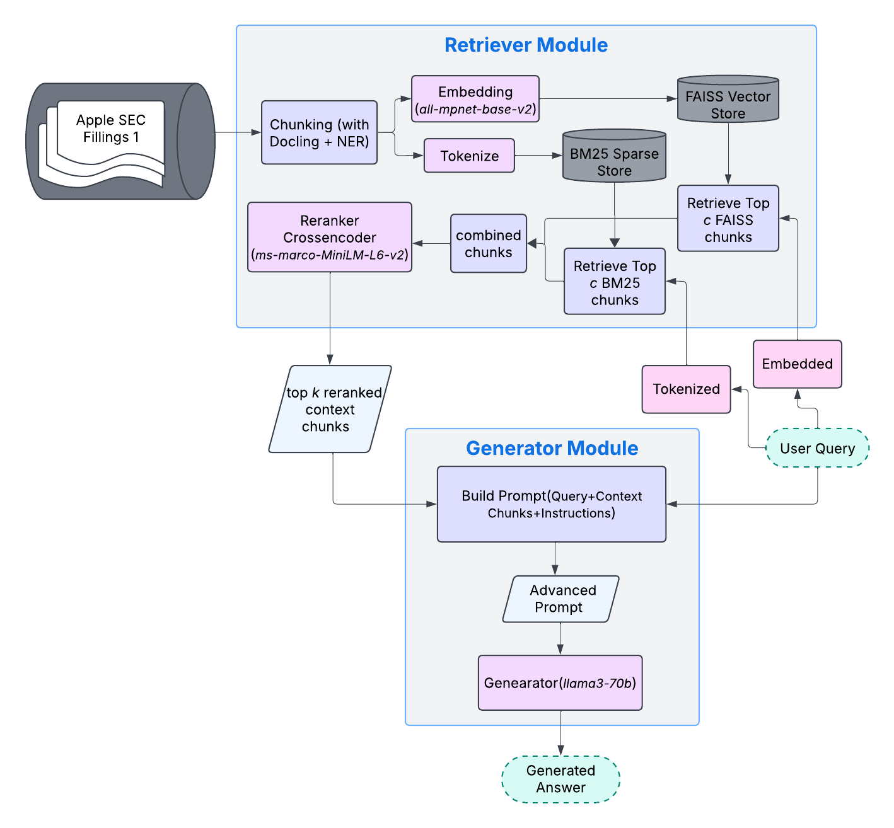

# RAG Project – Summer Semester 2025
## Overview
This project implements a domain-specific Retrieval-Augmented Generation (RAG) pipeline designed for question answering over financial documents such as 10-Ks, 10-Qs, and consolidated financial statements. The system combines hybrid retrieval methods, structured chunking, reranking, and task-aware prompting to improve answer accuracy and factual grounding.

## Structure
- `baseline/`: Common starter system (retriever + generator)
- `specialization/`: Contains classes and functions dedicated for specialization
- `experiments/`: Each team's independent exploration
- `evaluation/`: Common tools for comparing results, contains some test files and reports.
  - `test/`: contains testcase input files and generated report with evaluation having summary at the end.
  - `evaluation_result/`: contains detailed evaluation result with more metrics scores.
- `utils/`: Helper functions shared across code.
- `data/`: Contains the data, mostly document files. The current specialization uses findoc_xsm_samples containing 3 Apple and 3 Amazon SEC filling pdf.
- `homeworks/`: Contains all the homework independently. Files from this are also being incorporated in the baseline structure.
- `special note`: Any file ending with `_speci.py` indicate this file is dedicated for specialization use case.

## 🛠 Getting Started: Installation
**Step 1**: download and access the project in your device.
```bash
git clone repo_link
cd ./NLProc-Proj-M-SS25
```

(Optional) **Step 2**: Create a virtual environment
```bash
python -m venv nlp_proj_ss_25
```

Activate the virtual environment
```bash
# On macOS/Linux:
source nlp_proj_hw_w3/bin/activate
# On Windows:
nlp_proj_ss_25\Scripts\activate
```

**Step 3**: Install dependencies
```bash
pip install -r requirements.txt
```
> **Note for Windows users**:  
> If you encounter errors while installing `spaCy` or transformer-based spaCy model `en-core-web-trf`, you may need to install [Microsoft C++ Build Tools](https://visualstudio.microsoft.com/visual-cpp-build-tools/).

## Description
Domain-specific Retrieval-Augmented Generation (RAG) pipeline for question answering on financial documents. It combines hybrid retrieval (BM25 + FAISS), layout-aware chunking, reranking, and task-specific prompting to enhance answer accuracy and factual grounding. Evaluated on diverse financial QA datasets with multiple metrics.

<div align="center">
  
</div>

### Features

- **Hybrid Retrieval:** Combines sparse BM25 and dense FAISS (using `all-mpnet-base-v2` embeddings) to retrieve relevant document chunks.
- **Layout-Aware Chunking:** Utilizes Docling to chunk documents while preserving semantic and structural elements like tables and section headings.
- **CrossEncoder Reranking:** Refines retrieval results with a miniLM-based CrossEncoder (`ms-marco-MiniLM-L-6-v2`) for better context selection.
- **Task-Specific Prompting:** Adapts prompts based on question types (fact-based, summarization, comparative, etc.) to improve generation quality.
- **Evaluation:** Comprehensive evaluation on a curated QA dataset with metrics including Precision, Recall, F1, ROUGE-L, and BERTScore.

### Example Questions & Answers

#### Summarization question
``` json
  {
    "question": "Give an overview of Apple's newly announced products in Q2 2025?",
    "ground_truth": "During the second quarter of 2025, the Company announced iPhone 16e, iPad Air, iPad, MacBook Air, Mac Studio.",
    "answer_received": "In Q2 2025, Apple announced the following new or updated products: iPhone 16e, iPad Air, iPad, Mac Studio, and MacBook Air.",
    "actual_context_sentence": "During the second quarter of 2025, the Company announced the following new or updated products: • iPhone 16e • iPad Air • iPad • MacBook Air • Mac Studio",
    "source_type": "text",
    "difficulty": "hard",
    "question_type": "summarization",
    "f1": 0.611,
    "rouge_l": 0.462,
    "bert_f1": 0.851
  },
 ```
    - The retriever successfully mapped “Q2” to “second quarter” and matched the key action word "announced".
    - The system retrieved a contextually correct chunk with full product list.
 #### Yes/no question
``` json
  {
    "question": "Did Apple announced new iPhone 16e in Q2 2025?",
    "ground_truth": "Yes.",
    "answer_received": "Yes. The context states: \"During the second quarter of 2025, the Company announced the following new or updated products: · iPhone 16e...\"",
    "actual_context_sentence": "During the second quarter of 2025, the Company announced the following new or updated products: • iPhone 16e • iPad Air • iPad • MacBook Air • Mac Studio",
    "source_type": "text",
    "difficulty": "easy",
    "question_type": "yes/no",
    "f1": 0.111,
    "rouge_l": 0.091,
    "bert_f1": 0.49
  },
   ``` 
    - Context was correctly retrieved and matched.
    - However, short answers like "Yes" tend to score poorly on token-based F1 metrics despite being semantically correct.
#### Fact-based question
``` json
  {
    "question": "What products, services and Software did Apple announce in the second quarter of 2024?",
    "ground_truth": "MacBook Air 13-in and MacBook Air 15-in",
    "answer_received": "I don't know. The context only provides information about announcements in the third quarter of 2024 and the second quarter of 2025, but not the second quarter of 2024.",
    "actual_context_sentence": "Product, Service and Software Announcements The Company announces new product, service and software offerings at various times during the year. Significant announcements during fiscal year 2024 included the following: First Quarter 2024: MacBook Pro 14-in.; MacBook Pro 16-in.; and iMac. Second Quarter 2024: MacBook Air 13-in.; and MacBook Air 15-in.",
    "source_type": "text",
    "difficulty": "medium",
    "question_type": "fact-based",
    "f1": 0.062,
    "rouge_l": 0.103,
    "bert_f1": 0.457
  },
```
    - The retriever failed to prioritize the keyword "announce", retrieving nearby but unrelated chunks instead, where only "products", "services", "second quarter of 2024" were mentioned.
    - Emphasizes the need for word-level importance, especially for verbs tied to events or facts.

## Teams & Tracks
**Group**: `@Team Oneironauts`