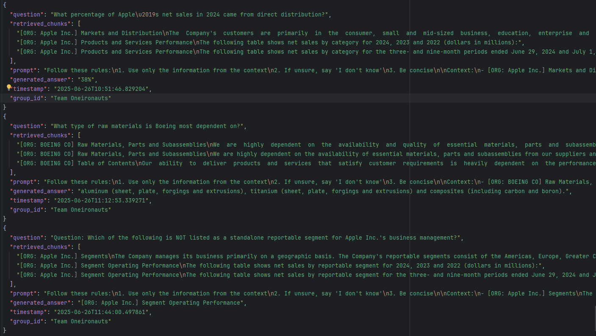

# RAG Project – Summer Semester 2025
## Overview
This repository hosts the code for a project on building and experimenting Financial documents(e.g: SEC fillings) with Retrieval-Augmented Generation (RAG) systems. A simple and extensible local Retrieval-Augmented Generation (RAG) system using Docling, FAISS and SentenceTransformers and T5.

## Structure
- `baseline/`: Common starter system (retriever + generator)
- `specialization/`: Contains classes and functions dedicated for specialization
- `experiments/`: Each team's independent exploration
- `evaluation/`: Common tools for comparing results, contains some test files and reports.
  - `test/`: contains testcase input files and generated report with evaluation having summary at the end.
- `utils/`: Helper functions shared across code.
- `data/`: Contains the data, mostly document files
- `homeworks/`: Contains all the homework independently. Files from this are also being incorporated in the baseline structure.
- `special note`: Any file ending with `_speci.py` indicate this file is dedicated for specialization use case.

## 🛠 Getting Started: Installation
**Step 1**: download and access the project in your device.
```bash
git clone repo_link
cd ./NLProc-Proj-M-SS25
```

(Optional) **Step 2**: Create a virtual environment
```bash
python -m venv nlp_proj_ss_25
```

Activate the virtual environment
```bash
# On macOS/Linux:
source nlp_proj_hw_w3/bin/activate
# On Windows:
nlp_proj_ss_25\Scripts\activate
```

**Step 3**: Install dependencies
```bash
pip install -r requirements.txt
```
## Description
Specialization sample questions and output,



## Teams & Tracks
**Group**: `@Team Oneironauts`